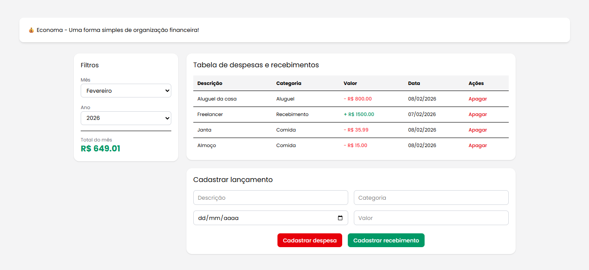

# 💰 Economa — Controle Financeiro Pessoal em React

**Economa** é uma aplicação web de **organização financeira mensal**, onde o usuário pode registrar **despesas e recebimentos**, acompanhar o **saldo do mês** e manter controle simples e rápido das finanças pessoais.

O projeto foi desenvolvido com foco em **simplicidade de uso**, **fluxo de dados previsível**, **integração front-end + back-end real** e aplicação de **boas práticas modernas de desenvolvimento full-stack**, servindo tanto como ferramenta funcional quanto como **projeto de estudo com React, API REST e banco relacional**.

---

## 📋 O que a Aplicação Permite

- 💸 **Registrar despesas**
- 💰 **Registrar recebimentos**
- 📅 **Filtrar por mês e ano**
- 🧮 **Visualizar saldo mensal automaticamente**
- 🗑 **Remover lançamentos**
- 🎨 **Feedback visual por cores (positivo e negativo)**
- ⚡ **Atualização imediata da interface após operações**

---

## ⚙️ Tecnologias Utilizadas

O projeto foi desenvolvido utilizando uma stack full-stack moderna:

### Front-end
- **React.js** — construção da interface
- **TailwindCSS** — estilização rápida e responsiva
- **Vite** — ambiente de desenvolvimento rápido
- **JavaScript (ES6+)**
- **HTML5 & CSS3**

### Back-end
- **Node.js**
- **Express**
- **Prisma ORM**
- **JavaScript**

### Banco de Dados
- **PostgreSQL**

Toda a comunicação ocorre via **API REST**, e a regra de negócio (cálculo do saldo e persistência) é centralizada no back-end para garantir consistência dos dados.

---

## 🎯 Objetivos do Projeto

- Praticar **integração React + API**
- Trabalhar com **persistência real em banco relacional**
- Aplicar **ORM (Prisma) na modelagem de dados**
- Implementar **CRUD completo**
- Construir uma aplicação **full-stack funcional**
- Consolidar arquitetura cliente-servidor

---

## 🖥️ Preview

